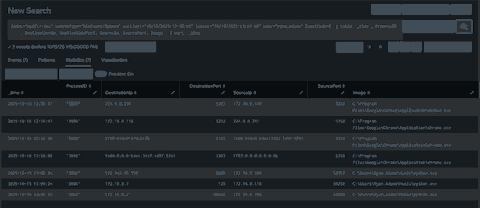

# Splunk 101 Capstone - Ryan Adams Incident Investigation


## Project Overview

Investigated a simulated endpoint compromise in Splunk using Windows Security logs, Sysmon, Zeek, Suricata, and Windows Application telemetry. I reconstructed the incident from authentication activity through suspicious file creation and execution, external command-and-control-style communication, internal DNS/RPC-related activity, scheduled-task persistence, and a later Windows Defender state change.

The investigation emphasizes a SOC analyst workflow: **start with a question, discover the relevant telemetry, pivot from evidence, correlate independent log sources, scope the activity, and separate facts from assessments and unknowns.**

## Scenario

Ryan Adams reported suspicious mouse movement on `FRONTDESK-PC1.KCD.local` around **2025-10-15 13:00 UTC**. The objective was to determine what happened, identify indicators of compromise, assess scope, and document evidence-supported conclusions.

## Key Findings

- Repeated failed authentication events were followed by successful **Type 3 network logons** using Ryan.Adams credentials.
- Windows Security mapped the authentication source to **DESKTOP-924H12 / 172.16.0.184**, using **NTLM / NtLmSsp**.
- The same source workstation/IP was associated with multiple usernames, a pattern consistent with credential guessing and possible password spraying.
- `chrome.exe` created `C:\Users\Ryan.Adams\Music\python.exe` at **12:57:00 UTC**.
- The suspicious `python.exe` executed at **13:00:33 UTC**.
- Sysmon attributed outbound communication from the process to **157.245.46.190:8888**.
- Zeek independently confirmed an established **TLSv1.3** session to the same external IP and port.
- The same process resolved `ADDC01.KCD.local` to `172.16.0.7` and contacted it over ports **135** and **49669**, consistent with RPC-related communication; successful lateral movement was **not confirmed**.
- PowerShell launched `schtasks.exe` to create the **PythonUpdate** task, configured to run the suspicious executable **at startup as SYSTEM**.
- Windows Security Center later reported `SECURITY_PRODUCT_STATE_SNOOZED`; the telemetry does not prove attacker causation.
- No matching external IOC or exact payload-path telemetry was observed from **13:15-14:00 UTC**, but persistence means that absence does not prove the threat was fully inactive.

## Investigation Flow

```text
Authentication failures
        |
        v
Successful network logon
        |
        v
Suspicious file creation by Chrome
        |
        v
python.exe execution
        |
        +--> External communication: 157.245.46.190:8888
        |       \--> Zeek TLS corroboration
        |
        +--> DNS lookup: ADDC01.KCD.local -> 172.16.0.7
        |       \--> RPC-related connections: 135 / 49669
        |
        v
Scheduled-task persistence: PythonUpdate
        |
        v
Defender SNOOZED state observed
```

## Evidence Highlights

### Failed logons


### Suspicious process execution


### Process-attributed network connections



## Skills Demonstrated

- Splunk Search Processing Language (SPL)
- Windows Security Event analysis
- Sysmon process, file, network, and DNS correlation
- Zeek and Suricata network telemetry analysis
- Authentication investigation and credential-attack analysis
- Process lineage and PID-based correlation
- IOC pivoting and environment scoping
- Scheduled-task persistence analysis
- Timeline reconstruction
- Evidence-based SOC reporting
- Distinguishing **fact**, **assessment**, and **unknown**

## Repository Structure

```text
Splunk101-Capstone/
|
|-- README.md
|-- capstone_report.pdf
|-- spl_queries.txt
`-- screenshots/
    |-- failed_logons_dashboard.png
    |-- malicious_execution_query.png
    `-- c2_network_connection.png
```

## Deliverables

- [Final SOC Investigation Report](capstone_report.pdf)
- [Key SPL Queries](spl_queries.txt)

## Investigation Boundaries

The available telemetry does **not** establish who controlled `DESKTOP-924H12`, whether RPC activity resulted in successful lateral movement to `ADDC01`, whether the Defender state change was attacker-caused, or the exact browser download URL/source of `python.exe`. These limitations are intentionally preserved in the final report instead of being presented as facts.

## Takeaway

This capstone demonstrates the core SOC habit I want to carry into production work: **do not jump to a conclusion first. Start with the evidence, pivot logically, corroborate across sources, and state only what the telemetry can support.**
